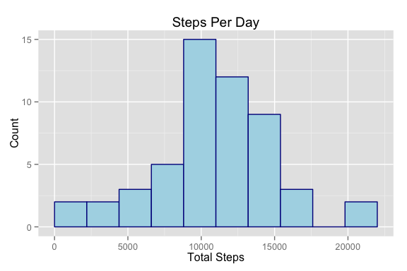

# Reproducible Research: Peer Assessment 1

<!-- Please set your working directory to this script's location :) -->

## Loading and preprocessing the data


```r
library(dplyr)
```

```
## 
## Attaching package: 'dplyr'
## 
## The following objects are masked from 'package:stats':
## 
##     filter, lag
## 
## The following objects are masked from 'package:base':
## 
##     intersect, setdiff, setequal, union
```

```r
library(ggplot2)
library(grid)

DataFilePath<-'activity.csv'
if(!file.exists(DataFilePath))
{
  unzip('activity.zip')
}
StepData<-read.csv(DataFilePath)

# General formatting and output options.
options(scipen=1, digits=3)
HistBinCount<-10
```


## What is mean total number of steps taken per day?


```r
# Function for computing total step values..
# Returns a list with the values we care about.
ComputeStepInfo<-function(stepData)
{
  # Remove all observations that don't include steps.
  # We will then group these items into individual days.
  perDay<-group_by(stepData, date)

  # From there, we can easily summarizethe total number of steps that we taken per day.
  tspd<-summarise(perDay, Total=sum(steps))

  list(totalByDay=tspd, mean=mean(tspd$Total), median=median(tspd$Total))  
}

# Remove all rows that don't have step information before computing totals, etc.
StepOnly<-filter(StepData, !is.na(steps))
stepStats<-ComputeStepInfo(StepOnly)
tspd<-stepStats$totalByDay


stepRange<-dist(range(tspd$Total))[[1]]
binWidth<- stepRange / HistBinCount

ggplot(data=tspd, aes(tspd$Total)) + 
       geom_histogram(binwidth=binWidth, fill="lightBlue", color="darkBlue") +
       ggtitle("Steps Per Day") +
       xlab("Total Steps") +
       ylab("Count")
```

 

Interesting Information:  
1. Mean Total Steps per Day: **10766.189**  
2. Median Total Steps per Day: **10765**

## What is the average daily activity pattern?


```r
# Group the samples by their interval ID, and then get their mean values.
ByInterval<-group_by(StepOnly, interval)

# Get mean steps per interval.
mspi<-summarise(ByInterval, mean=mean(steps))

# Let's create a resonable looking x-axis that better denotes time.
# We are assuming that the day starts at midnight, and the data seems to support this since there are
# few steps at this time (i.e. people are sleeping)

breakCount<-6
MAX<-2400
breaks<-seq(from=0, by=(MAX/breakCount), length=breakCount)
xlabs<-paste(breaks / 100, "00", sep=":")

# Add the final values for the breaks/labels.
# This just makes the axis look a bit nicer.
breaks<-append(breaks, 2355)
xlabs<-append(xlabs, "23:55")

# And now we plot.
ggplot(data=mspi, aes(x = interval, y=mean)) + 
       geom_line() +
       scale_x_discrete(limits=breaks, breaks=breaks, labels=xlabs) +
       xlab("Time of Day") +
       ylab("Mean Steps") +
       ggtitle("Daily Mean of Steps per Interval")
```

 

```r
# Finally, we can decide which interval has the highest average across all days
maxIndex = which.max(mspi$mean)
maxInterval = mspi$interval[[maxIndex]]
```

The interval with the highest mean number of steps is: **835**

## Imputing missing values


```r
naCount<-sum(is.na(StepData$steps))
```

There are 2304 missing values in the original data set.

<!-- We already have the interval means, so we are going to use those to impute the missing values -->

```r
# Determine the row indexes of the missing values, and using their interval, lookup 
# the corresponding mean step value.  We are using the mean values that we computed from the previous
# step to fill in the missing data.
missing<-which(is.na(StepData$steps))
match<-StepData[missing,"interval"]
fillSteps<-mspi[mspi$interval %in% match, "mean"]

# Now we can backfill the missing data in a new data set.
# We truncate the data a small amount so that we don't have partial steps, i.e. it doesn't make sense for
# someone to have taken 1.18 steps in a day.
FixedSteps<-StepData
FixedSteps[missing,"steps"]<-trunc(fillSteps$mean)

fixedStepStats<-ComputeStepInfo(FixedSteps)
tspd<-stepStats$totalByDay

stepRange<-dist(range(tspd$Total))[[1]]
binWidth<- stepRange / HistBinCount

ggplot(data=tspd, aes(tspd$Total)) + 
       geom_histogram(binwidth=binWidth, fill="pink", color="darkRed") +
       ggtitle("Steps Per Day (fixed)") +
       xlab("Total Steps") +
       ylab("Count")
```

 

```r
meanDiff<-stepStats$mean-fixedStepStats$mean
medianDiff<-stepStats$median-fixedStepStats$median
```

After fixing the missing values, the mean and medians are slightly different:  
Fixed Mean: **10749.77**  
Fixed Median: **10641**

We can easily see that imputing the missing values has had a small impact, but not a significant one:  
Mean Difference: **16.418** (0.153%)  
Median Difference: **124** (1.165%)

## Are there differences in activity patterns between weekdays and weekends?


```r
# Determine which entries are weekdays / weekends.
allDays<-weekdays(strptime(as.character(FixedSteps$date), format="%Y-%m-%d"))
dayType<-sapply(allDays, function(x) if (x=="Saturday" | x=="Sunday") { "Weekend" } else { "Weekday"}, USE.NAMES=FALSE  )
dayFactor = as.factor(dayType)

# Apply to our data frame...
FixedSteps$DayType<-dayFactor


ComputeAverages<-function(stepData)
{
  byInterval<-group_by(stepData, interval)
  summarise(byInterval, AvgSteps=mean(steps))
}

# Now split out two new datasets, one for Weekdays, and others for weekends.
WeekendData<-filter(FixedSteps, DayType == "Weekend")
WeekdayData<-filter(FixedSteps, DayType == "Weekday")

AvgWeekend<-ComputeAverages(WeekendData)
AvgWeekday<-ComputeAverages(WeekdayData)

# Put them back together for plotting.  We could leave them seperate for lattice plotting,
# or base plotting, but I think that ggplot just looks better at the end of the day.
AvgWeekend$DayType = "Weekend"
AvgWeekday$DayType = "Weekday"
Combined<-rbind(AvgWeekend, AvgWeekday)

ggplot(data=Combined, aes(x=interval, y=AvgSteps)) +
    geom_line() +
    scale_x_discrete(limits=breaks, breaks=breaks, labels=xlabs) +
    facet_wrap(~DayType, nrow=1) +
    theme(panel.margin = unit(2, "lines")) +
    ylab("Average Steps") +
    xlab("Time of Day") +
    ggtitle("Average Steps: Weekday vs. Weekend")
```

 

